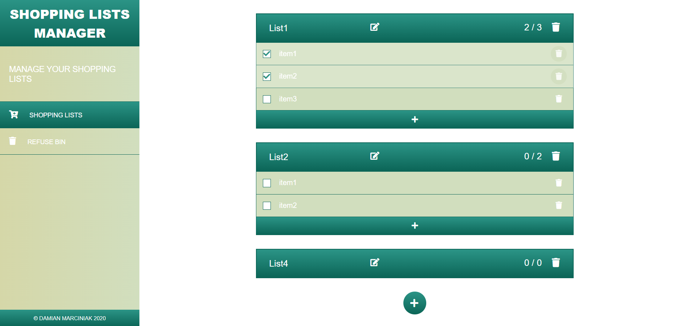
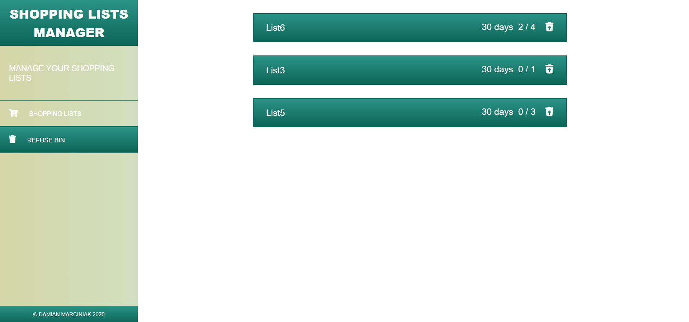

# Shopping Lists Manager

Full responsive dynamic website for managing shopping lists.
<br>
This application doesn't need any registration and login.
All the lists you create will be saved in your browser memory
(using localStorage property).
<br>
Creating lists with this application is very quick and simple. 
All what you need is click on SHOPPING LISTS
menu item and create your first list.
<br>
When the first list is created you can manage them by adding next 
items and marking purchased items.
<br>
When you will find the list will not be useful anymore, you can remove it. 
After that the list is moved to a refuse bin and is removed 
after 30 days from that time. But before that time is up 
you can recover any list you wish.

---

## Functionalites

You can freely manage your lists by:
* adding new lists
* removal of specific lists
* retrive a removed lists
* auto removing lists in refuse bin after 30 days
* renaming lists
* adding items to list
* removal items from list
* updating the items in the list
* marking purchased items

---

## Screenshots


<p align="center">Fig. 1 Shopping Lists</p>


<p align="center">Fig. 2 Refuse Bin</p>

---

## Technology
* HTML5
* CSS3 + Bootstrap
* JavaScript + React.js

---

## Requirements
* web browser - Chrome, Edge, Firefox etc. (for running) 
* git CLI and heroku CLI installed (for deploying)

---

## Deploying & Running
Example for Linux system and Heroku cloud platform.

Run your terminal and type below commands: 
```
git clone https://github.com/dmarcini/shopping-lists-manager
cd portfolio
rm -r .git

git init
git add *
git commit -m "Your commit name"

heroku login
heroku apps:create your-site-name
git push heroku master
```
After this step your site should be available on: <br>
https://your-site-name.herokuapp.com
